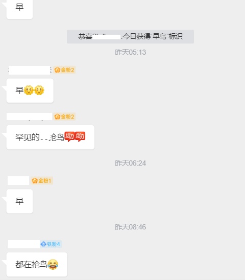
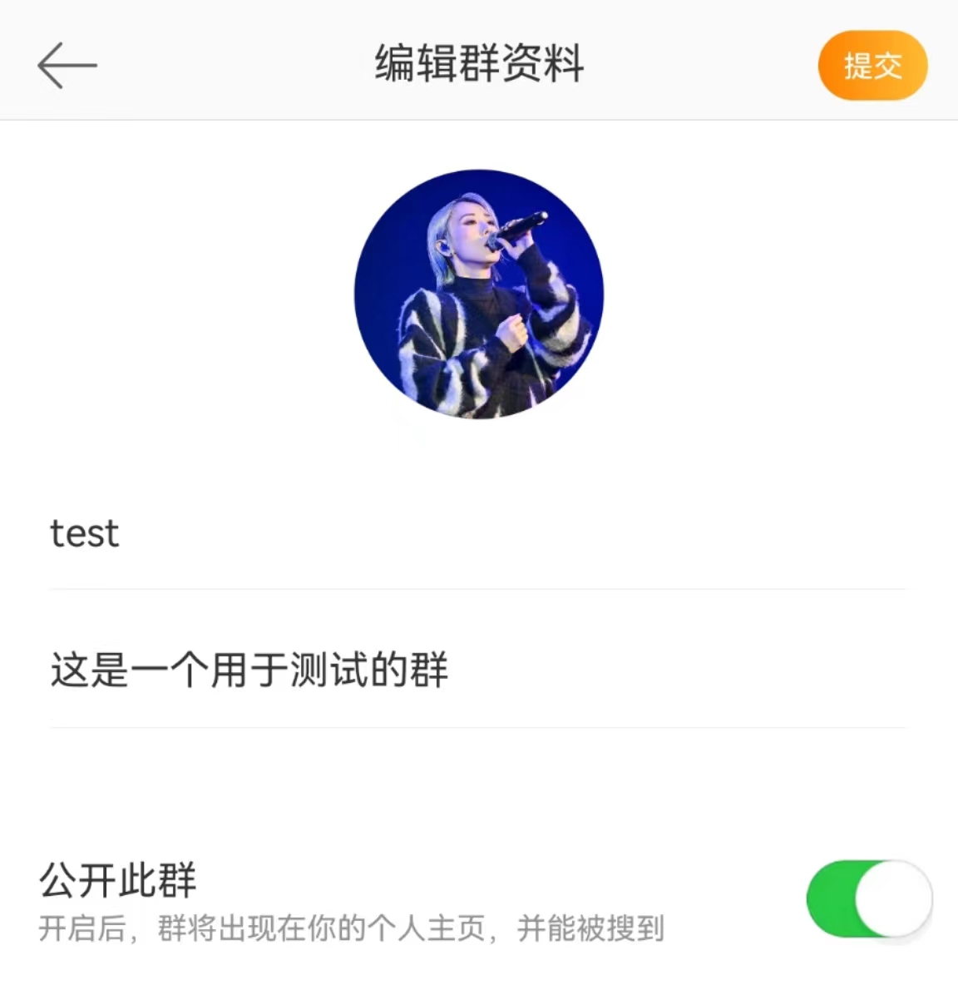
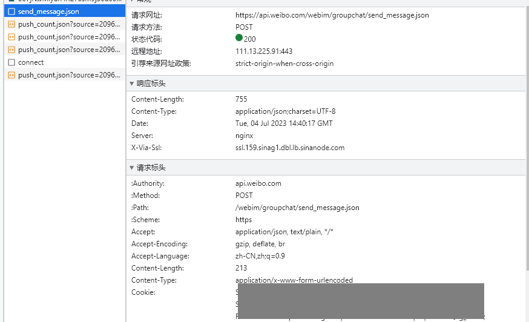
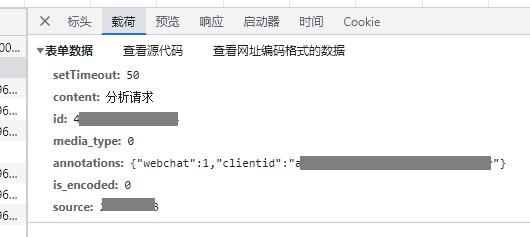
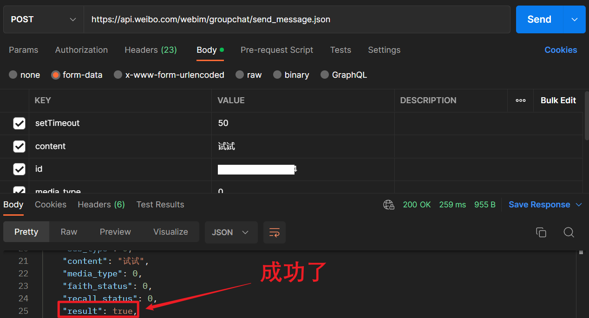
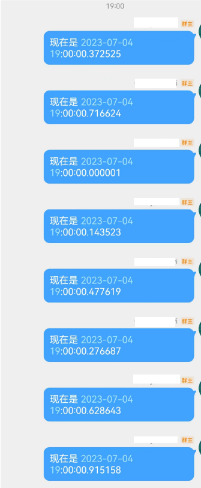
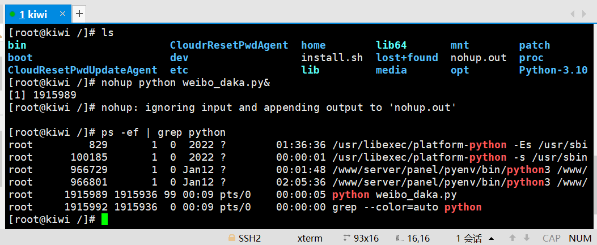
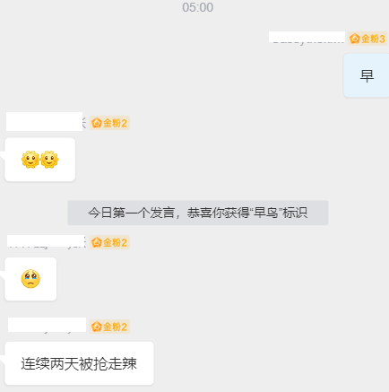
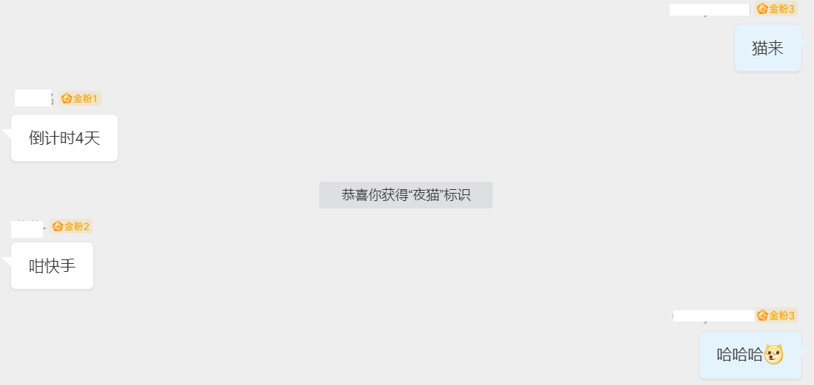

# 【原创】Python脚本新浪微博群抢早鸟+夜猫（2024.1.9可用）

微博粉丝群每天看着大家抢鸟，真的好羡慕哇！但是早鸟得早上5点，这也太难了吧~



作为一名热爱 coding 的计科生，我想看看使用编程知识试试能不能破解万年抢不到的魔咒~~

## 开发者文档

首先我找到了微博开发者文档，成功开通了这个服务。

https://open.weibo.com/wiki/%E5%BE%AE%E5%8D%9AAPI

可惜翻了很久，发现官方并没有给在群里定时发送消息的 API

## 自己写一个吧

没办法，那就试试自己写一个吧

### 1. 首先新建一个测试群



### 2. 然后分析发送消息的请求

- 确定 url：https://api.weibo.com/webim/groupchat/send_message.json
- header



- 载荷



### 3. postman 测试接口

成功了~ 现在接口已经拿到了😏



### 4. 写脚本环节

#### 遇到的问题及解决方案：

1. 因为 cookie 会过期，所以我设置了整点访问一次。可以持久化 cookie，更新它的 expire time。

2. 整点发送消息会一秒钟发送多条消息，因为死循环获取到的时间是同一秒内的：

   

   因此发送一条消息后，需要休眠一阵子，我这里设置了 2 min。

   ```python
   time.sleep(120)
   ```

### 5. 部署到云服务器上



### 6. 测试

大功告成！

- 早鸟

  

- 夜猫



